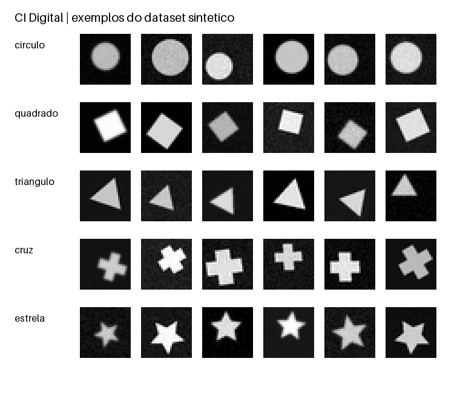

# CI Digital — CNN em Python e SystemVerilog

Projeto acadêmico completo para classificar cinco figuras geométricas (`círculo`, `quadrado`, `triângulo`, `cruz` e `estrela`) com uma CNN treinada em Python e uma implementação de inferência em SystemVerilog.

O repositório inclui o dataset sintético, notebook, código Python, módulos e testbenches SystemVerilog, pesos treinados e de demonstração, checkpoint, métricas, resultados, vetores de referência e documentação.

## Comece por aqui

- [Guia passo a passo de Python — versão 3](docs/01_Guia_Python_v3.pdf)
- [Guia passo a passo de SystemVerilog](docs/02_Guia_SystemVerilog.pdf)
- [Notebook de treinamento e exportação](notebooks/01_treino_exportacao.ipynb)
- [Prévia do dataset](dataset/preview.png)
- [Estado e limites da validação](reports/validation_status.json)
- [Contrato RTL e simulação online](docs/CONTRATO_RTL_E_SIMULACAO.md)
- [Evidência da simulação HDL online](reports/hdl_online_verification_2026-09-27.md)

## Conteúdo principal

```text
dataset/               2.000 imagens PNG + manifesto + prévia
docs/                  dois guias em PDF
notebooks/             notebook editável
python/                geração, treino, quantização e exportação
rtl/                   módulos SystemVerilog
tb/                    testbenches
exports/trained/       pesos treinados, metadados e vetores
exports/demo/          pesos reproduzíveis de demonstração
eda_playground/        versões autocontidas para simulação online
runs/baseline/         checkpoint, histórico, métricas e predições
reports/               logs e estado real da validação
tests/                 testes Python e verificação escalar
```

## Campanha atual: baseline 70/20/10 e cinco folds

O dataset contém 2.000 imagens de 28 × 28 pixels em tons de cinza, com cinco classes de 400 imagens. A campanha atual usa uma divisão estratificada de 1.400 imagens de treino, 400 de validação e 200 de teste no baseline (280/80/40 por classe).

As mesmas 200 imagens de teste, 40 por classe, ficam reservadas para o baseline e todos os cinco folds. O K-fold atua somente nas outras 1.800 imagens. Cada fold usa 1.440 imagens de treino e 360 de validação, equivalentes a 72/18/10 do total. O baseline não entra na média dos folds.

| Modelo | Python float ACC | Python inteiro / RTL ACC | Variação (pontos percentuais) |
| --- | ---: | ---: | ---: |
| Baseline | 88,50% | 89,00% | +0,50 |
| Fold 1 | 88,00% | 86,50% | -1,50 |
| Fold 2 | 90,00% | 90,00% | 0,00 |
| Fold 3 | 86,50% | 86,00% | -0,50 |
| Fold 4 | 93,50% | 93,00% | -0,50 |
| Fold 5 | 92,50% | 93,50% | +1,00 |
| Média dos cinco folds ± desvio padrão amostral | 90,10% ± 2,95 | 89,80% ± 3,51 | -0,30 |

A quantização reduz a acurácia média em 0,30 ponto percentual, aproximadamente 0,33% em termos relativos. Não há perda adicional ao executar o modelo inteiro no HDL: os logits e as classes coincidem exatamente com a referência Python quantizada nas 1.200 inferências (seis modelos × 200 imagens). Cada inferência usa 206.520 ciclos de processamento simulados, sem incluir carga da imagem. Não houve implantação física em FPGA.

O protocolo, comandos e evidências estão em [RTL_CV_RESULTS.md](RTL_CV_RESULTS.md), [resumo Python](runs/cv_70_20_10/summary.json) e [resumo RTL](results/rtl_cv_70_20_10/summary.json). Para reproduzir essa campanha, use `ci_digital_cv_train.py` e `validate_rtl_cv.py`. Os manifestos `runs/cv_70_20_10/*/split_manifest.csv` são a fonte da divisão atual.



## Registros históricos preservados

As pastas físicas `dataset/train`, `dataset/val` e `dataset/test` preservam a organização original 1.400/300/300 (70/15/15). A campanha atual redistribui essas mesmas imagens por manifesto, sem depender dessas pastas como conjuntos de avaliação. O notebook v2 e o gerador original reproduzem o fluxo histórico, não a campanha 70/20/10.

### Resultados históricos do treinamento de referência

| Avaliação sobre 300 imagens de teste | Resultado |
| --- | ---: |
| CNN em ponto flutuante | 288/300 — 96,00% |
| Referência inteira quantizada | 289/300 — 96,33% |
| Concordância de classe entre as versões | 299/300 — 99,67% |

Esses números descrevem apenas a execução incluída e o dataset sintético deste projeto; não constituem validação com imagens reais de drones.

### Validação histórica de referência

A parte Python foi executada e testada. Em 27/09/2026, a RTL SystemVerilog completa também foi compilada e simulada com Icarus Verilog em uma execução privada do GitHub Actions. Passaram os testes aritméticos, dez vetores com pesos sintéticos determinísticos e vinte vetores com pesos treinados, com comparação exata de 9.102 valores por vetor. Consulte a [evidência da execução](reports/hdl_online_verification_2026-09-27.md).

A simulação não equivale a síntese, análise de timing ou validação em FPGA física; essas etapas permanecem pendentes.

O registro `reports/validation_status.json` abaixo documenta a execução histórica v2. O estado atual e a validação dos seis modelos são os resumos da campanha 70/20/10 acima. Não se deve confundir os resultados antigos em 300 imagens com os resultados atuais em 200.

Consulte os guias de [Python](docs/01_Guia_Python_v3.pdf) e [SystemVerilog](docs/02_Guia_SystemVerilog.pdf) para as instruções de treinamento, exportação e simulação, além do [contrato numérico](docs/CONTRATO_RTL_E_SIMULACAO.md) usado entre Python e RTL.

## Proveniência

Os arquivos do pacote original foram preservados. A identificação do ZIP-fonte está registrada em [SOURCE_ARCHIVE_SHA256.txt](SOURCE_ARCHIVE_SHA256.txt).

